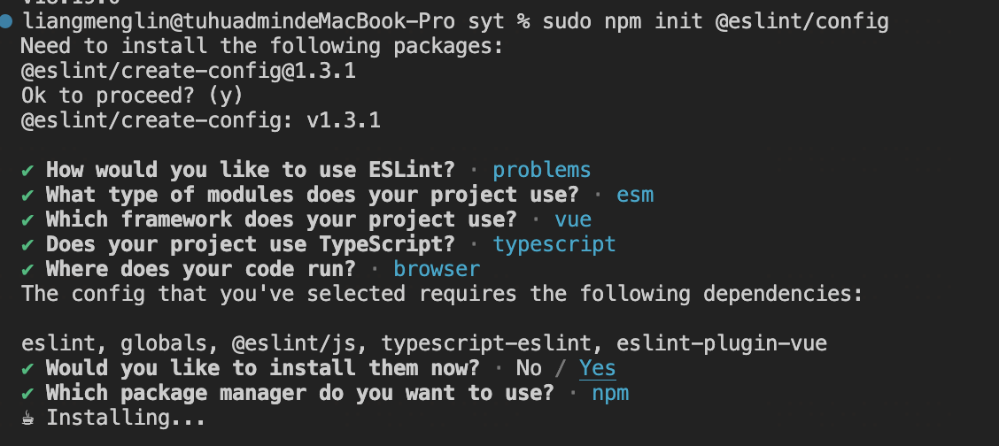

##### Vue3 + TypeScript + Vite 项目配置 Eslint

1. 安装 ESlint 和相关插件

   ```
   npm install eslint eslint-plugin-vue @typescript-eslint/parser @typescript-eslint/eslint-plugin -D
   ```

`eslint`: 核心 ESlint 工具，负责代码的静态分析和检测

`eslint-plugin-vue`：专为 Vue 项目提供的 ESlint 插件，包含了适用于 Vue.js 的一组规则，可以帮助检测和修复 Vu e 代码中的问题

`@typescript-eslint/parser`：TypeScript 解析器，用于将 TypeScript 代码解析成 ESlint 可以理解的 AST。这样 ESlint 就可以对 TypeScript 进行静态代码分析了

`@typescript-eslint/eslint-plugin`：为 ESlint 提供一组 TypeScript 规则，结合@typescript-eslint/parser 可以使 Eslint 对 TypeScript 代码进行更有效的检查

2. 配置 ESlint 配置文件

   ```
   npm init @eslint/config
   ```

   `执行成功后，在根目录下创建了一个.eslintrc.config.js的文件，并添加以下配置`

   ```javascript
   import globals from 'globals';
   import pluginJs from '@eslint/js';
   import tseslint from 'typescript-eslint';
   import pluginVue from 'eslint-plugin-vue';

   export default [
     { files: ['**/*.{js,mjs,cjs,ts,vue}'] },
     { languageOptions: { globals: globals.browser } },
     pluginJs.configs.recommended,
     ...tseslint.configs.recommended,
     ...pluginVue.configs['flat/essential'],
     { files: ['**/*.vue'], languageOptions: { parserOptions: { parser: tseslint.parser } } },
     {
       rules: {
         '@typescript-eslint/no-explicit-any': 'off',
         'vue/multi-word-component-names': 0,
       },
     },
   ];
   ```

3. 在 Vite 中配置 ESLint

   ```
   npm i vite-plugin-eslint -D
   ```

   编辑 vite.config.ts 文件，添加 ESLint 插件

   ```js
   import { defineConfig } from 'vite';
   import vue from '@vitejs/plugin-vue';
   import eslintPlugin from 'vite-plugin-eslint';

   // https://vitejs.dev/config/
   export default defineConfig({
     plugins: [vue(), eslintPlugin()],
   });
   ```
