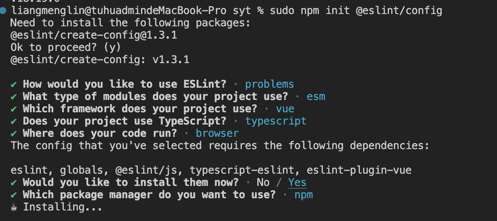

##### Vue3 + TypeScript + Vite项目配置Eslint

1. 安装ESlint和相关插件

   ```
   npm install eslint eslint-plugin-vue @typescript-eslint/parser @typescript-eslint/eslint-plugin -D
   ```

`eslint`: 核心ESlint工具，负责代码的静态分析和检测

`eslint-plugin-vue`：专为Vue项目提供的ESlint插件，包含了适用于Vue.js的一组规则，可以帮助检测和修复Vu e代码中的问题

`@typescript-eslint/parser`：TypeScript解析器，用于将TypeScript代码解析成ESlint可以理解的AST。这样ESlint就可以对TypeScript进行静态代码分析了

`@typescript-eslint/eslint-plugin`：为ESlint提供一组TypeScript规则，结合@typescript-eslint/parser可以使Eslint对TypeScript代码进行更有效的检查

2. 配置ESlint配置文件

   ```
   npm init @eslint/config
   ```

   `执行成功后，在根目录下创建了一个.eslintrc.config.js的文件，并添加以下配置`

   ```javascript
   import globals from "globals";
   import pluginJs from "@eslint/js";
   import tseslint from "typescript-eslint";
   import pluginVue from "eslint-plugin-vue";
   
   
   export default [
     {files: ["**/*.{js,mjs,cjs,ts,vue}"]},
     {languageOptions: { globals: globals.browser }},
     pluginJs.configs.recommended,
     ...tseslint.configs.recommended,
     ...pluginVue.configs["flat/essential"],
     { files: ["**/*.vue"], languageOptions: { parserOptions: { parser: tseslint.parser } } },
     {
       rules: {
         '@typescript-eslint/no-explicit-any': 'off',
         'vue/multi-word-component-names': 0,
       },
     },
   ];
   ```

   

3. 在Vite中配置ESLint

   ```
   npm i vite-plugin-eslint -D
   ```

   编辑vite.config.ts文件，添加ESLint插件

   ```js
   import { defineConfig } from 'vite'
   import vue from '@vitejs/plugin-vue'
   import eslintPlugin from 'vite-plugin-eslint'
   
   // https://vitejs.dev/config/
   export default defineConfig({
     plugins: [vue(), eslintPlugin()],
   })
   ```