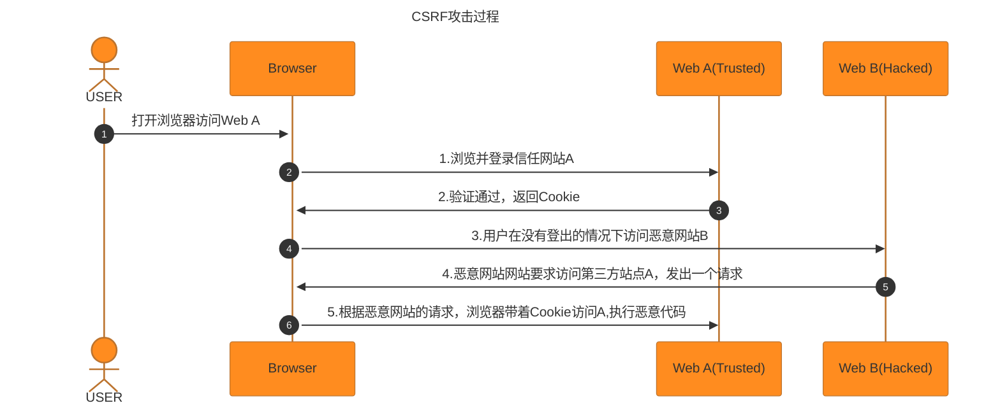
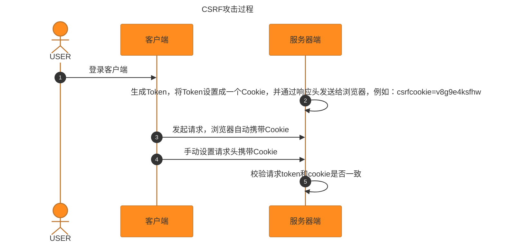

#### CSRF 攻击

> CSRF 跨站请求伪造，是一种网络攻击手段。攻击者诱导受害者进入第三方网站，在第三方网站中，向被攻击网站发送跨站请求。利用受害者在被攻击网站已经获取的注册凭证，绕过后台的用户验证，达到被冒充用户对被攻击的网站执行某项操作。

##### CSRF 攻击方式

- 受害者登录 a.com,并保留登录凭证 Cookie
- 攻击者引诱受害者访问 b.com
- b.com 向 a.com 发送了一个请求：a.com/act=xx。浏览器会默认携带 a.com 的 Cookie
- a.com 接收到请求后，对请求进行验证，并确认是受害者的凭证，误以为是受害者自己发送的请求
- a.com 以受害者的名义执行 act=xxx
- 攻击完成，攻击者在受害者完全不知情的情况下，冒充受害者，让 a.com 执行了自己定义的操作

##### CSRF 攻击特点

- 访问了第三方的恶意链接，通常是跨域的
- 在保持登录的状态访问，身份标志被冒用



##### 常见的攻击类型

- <strong>GET 类型的 CSRF</strong>

```

```

受害者在登录了银行网站，保存了 Cookie 的前提下。受害者访问含有这个 img 的页面，浏览器会发起http://back.example.com/transfer?account=xiaoming&amount=10000&for=hacker这个请求并携带登录银行网站保存的Cookie。这导致银行会认为这个请求是本人发起的，银行会根据请求参数执行操作。

- <strong>POST 类型</strong>

  ```
  <form action="http://bank.example/transfer" method="POST">
    <input type="hidden" name="account" value="xiaoming" />
    <input type="hidden" name="amount" value="10000" />
    <input type="hidden" name="for" value="hacker" />
  </form>
  <script>
    document.forms[0].submit();
  </script>
  ```

​ 访问带有这一段代码的恶意网站，表单会自动提交，相当于模拟用户完成了一次 POST 操作

- **链接类型**

  ```
  <a href="http://test.com/csrf/transfer.php?amount=1000&for=hacker" taget="_blank">重磅消息！！</a>
  ```

  需要点击才会触发

##### 攻击特点

- 一般发起在第三方网站
- 利用受害者被攻击网站的登录凭证
- 整个过程攻击者并不能活去到受害者的登录凭证，仅仅是冒用
- 跨站请求可以用各种方式：图片 URL，超链接，CORS，FORM 表单。部分请求可以直接嵌入第三方轮胎，文章中。
- 由于服务器的同源策略，黑客也无法进行解析。因此黑客无法从返回的结果中得到任何东西，只能做到给服务器发送请求，以执行请求中所描述的命令，在服务器端直接改变数据的值，而非窃取服务器中的数据。所以，保护的对象是那些可以直接改变的数据，对于读取操作，无需进行保护。

##### 防御思路

> 根据特点分析，CSRF 通常发生在 **第三方域名**.攻击者**获取不到 Cookie**等信息，只能**冒用**

- **防止不明外域访问**

> **同源检测机制**：服务器通过请求头携带 Origin 和 Referer 字段确定请求来源域。Origin 和 Referer 都是表示请求的来源，区别是 Origin 仅包含协议，主机，端口，而 Referer 包含其余的 Path 参数。浏览器在发起请求时，通常会包含这两种头。

```
Origin: http://foo.example
根据HTTP协议，在HTTP请求头中有一个字段叫Referer，记录了该HTTP请求的来源地址
Referer来源地址，Referer中的Origin部分可以得到请求的来源域名
```

但是这种检测方式比较简单，而且对请求头的依赖过高。比如 Origin 标头在以下几种情况不存在：

- 跨域的重定向请求
- 跨域的媒体文件(图片，音频等)
- 请求协议不是 HTTP，HTTPS，WebSocket,Gopher 或者文件 URL
- 响应网络错误

**使用 Referrer 的方式**

新版 Referer Policy 规定了五种 Referer 策略

1. **No Referrer**: no-referrer
2. **No Referrer When Downgrade**: no-referrer-when-downgrade
3. Origin Only: origin
4. Origin When Cross-origin: origin-when-crossorigin
5. Unsafe URL: unsafe-url

Content-Security-Policy 响应头，通过 referrer 指令和 5 种可选指令来指定 referrer 策略

```
Content-Security-Policy: referrer no-referrer | no-referrer-when-downgrade | origin | origin-when-cross-origin | unsafe-url;
```

meta 元数据标签可以指定 referrer 策略

```
<!-- 在任何情况下，仅发送文件的源作为引用地址 -->
<meta name="referrer" content="origin" />
```

外链标签中的 referrer 属性，或者用 a,area,img,iframe,script,link 标签元素上的 referrer policy 属性为其设置独立的请求策略

```
<a href="http://example.com" referrerpolicy="origin"></a>
```

可以在 a,area,link 元素上将 rel 属性设置为 noreferrer

```
<a href="http://example.com" referrer="no-referrer|origin|unsafe-url">xxx</a>
```

**Samesite Cookie**

> set-cookie 是一个通过服务器端向用户客户端发送 cookie 得响应头，用户代理可再后续的请求中将其发送回服务器。服务器发送多少个 cookie，就携带多少个 set-cookie 响应头。这个头有一个属性叫 SameSite，它允许服务器设定一条 cookie 不随跨站请求一起发送

```
Set-Cookie: CookieName=CookieValue; SameSite=Lax;
```

可取值

1. Strict：完全禁止第三方 Cookie，跨站点时，任何情况下都不会发送 cookie。只有当网页的 URL 与请求目标一致，才会带上 Cookie
2. Lax：大多数情况不发送第三方 Cookie，但是导航到目标网站的 GET 请求除外
3. None

**CSRF Token**

> 攻击者无法直接窃取用户信息，仅仅是冒用 Cookie 中的信息，而 CSRF 攻击之所以能够成功，是因为服务器误把攻击者发送的请求当成了用户自己的请求。那么可以要求所有用户请求都携带一个 CSRF 攻击者无法获取的 Token。服务器通过校验请求携带的 Token，来把正常的请求和攻击的请求区分开，也可以防范 CSRF 的攻击。

**策略防护步骤**:

1. **生成 Token,存储在 Session 中，与会话绑定**

   > 用户登录，服务器生存一个 CSRF Token 存储在服务器端 Session 中，通常是健值对的形式存储，健是 Token 名称，值是 Token 值。将 Token 与用户恢会话绑定，用户请求携带会话 ID 访问服务器，服务器可以根据 ID 取出对应的 Token

2. **将 CSRF Token 传递给客户端**

   > 服务器将生成的 CSRF Token 发送给客户端嵌入到网页中
   >
   > - 通过隐藏表单字段传递，适用于传统的 HTML 表单提交，服务器在渲染 HTML 页面是，将 Token 插入到隐藏字段中，当用户提交表单时，浏览器会将该隐藏字段与其他表单数据一起提交到服务器。
   > - 通过 Cookie 传递，适合于 SPA 或 AJAX 请求场景，服务器将生成的 Token 通过 Cookie 的形式传递给客户端。浏览器会自动将 Cookie 存储在客户端，并在后续请求中携带。

   ```javascript
   // 获取 Cookie 中的 CSRF Token
   function getCsrfTokenFromCookie() {
     let csrfToken = document.cookie.split('; ').find((row) => row.startsWith('csrf_token='));
     return csrfToken ? csrfToken.split('=')[1] : null;
   }

   // 在 AJAX 请求中使用 CSRF Token
   fetch('/submit', {
     method: 'POST',
     headers: {
       'Content-Type': 'application/json',
       'X-CSRF-Token': getCsrfTokenFromCookie(), // 自定义请求头发送 Token
     },
     body: JSON.stringify({ data: 'example' }),
   });
   ```

3. **客户端与服务器之间 Token 传递**

   > 每次用户请求，Token 会随着请求一起发送服务器，服务器接收到请求后，会从请求数据中提取出 Token，并与服务器存储的 Token 进行比较。
   >
   > 在服务器端，会话通常会存储在内存，数据库或文件中，并且会话 ID 通常通过 HTTP Cookie 传递给客户端。每次请求时，浏览器会自动携带会话 ID 的 Cookie，服务器根据 ID 来检索会话数据并验证请求中 CSRF Token 是否匹配。

4. **会话周期管理**

   > 当用户第一次访问，会生成一个新的会话 ID
   >
   > 会话通常有一个效期，超过时间会失效，需要重新登录

- **分布式校验**

> 在大型网站中，使用 Session 存储 CSRF Token 会带来很大的压力。访问单台服务器 session 是同一个。但是在大型网络中，服务器通常不止一台，可能是几十台甚至几百台，甚至多个机房都可能在不同的省份，用户发起的 HTTP 请求通常要经过像 Nginx 之类的负载均衡之后，再路由到具体的服务器上。由于 Session 默认存储在单机服务器内存中，因此在分布式环境下同一个用户发送的多次 HTTP 请求可能会先后落到不同的服务器上，导致后面发起的 HTTP 请求无法拿到之前的 HTTP 请求存储在服务器中的 Session 数据。从而使得 Session 机制在分布式环境下失效，因此在分布式集群中，CSRF Token 需要存储在 Redis 之类的公共存储空间。

由于使用 Session 存储，读取和验证会引起比较大的复杂度和性能问题，很多网站采用 Encrypted Token Pattern 方式。这种方法的 Token 是一个计算出来的结果，而非随机生成的字符串。这样在校验的时候无需读取存储的 Token，只需要在计算一次即可。

这种 Token 的值通常是 UserID,时间戳和随机数，通过加密的方式生成。这样既可以保证分布式服务的 Token 一致，又能保证 Token 不容易被破解。

在 Token 解密成功后，服务器可以访问解析值，Token 中包含的 UserId 和时间戳会被拿来验证有效性。当 UserId 和当前 UserID 进行比较。

- **双重 Cookie 验证**

> 同时使用两个 Cookie 来验证请求合法性，其中一个 Cookie 由浏览器自动发送，另一个需要通过请求头或者请求参数手动发送。这种方案对比 CSRF Token 方案来说，好在不需要生成额外的 Token，不依赖于服务器端的会话状态因此也不需要存储 Token，同样能够起到防御 CSRF 攻击的效果
>
> 虽然浏览器只要在某个与名下设置了 Cookie，就默认会将后续的请求中自动携带 Cookie，但是在跨域的请求中或者设置了 SameSite，则不会携带，所以此方法不适合严格的跨域策略

流程：

1. 服务器端生成 Token

2. 服务器将 Token 设置成一个 Cookie，并通过响应头发送给浏览器，例如：csrfcookie=v8g9e4ksfhw

3. 浏览器在向服务器发起请求时，会自动携带 csrfcookie 的 Token,这是浏览器默认行为

4. 客户端需要读取这个 Cookie,并在请求时将其添加到请求中去，通常是作为请求参数或者自定义请求头传递

   ```javascript
   // 从 Cookie 中读取 CSRF Token
   function getCsrfTokenFromCookie() {
     let csrfToken = document.cookie.split('; ').find((row) => row.startsWith('csrfcookie='));
     return csrfToken ? csrfToken.split('=')[1] : null;
   }

   // 在 AJAX 请求中使用双重 Cookie 传递 CSRF Token
   fetch('/submit', {
     method: 'POST',
     headers: {
       'Content-Type': 'application/json',
       'X-CSRF-Token': getCsrfTokenFromCookie(), // 自定义请求头传递 CSRF Token
     },
     body: JSON.stringify({ data: 'example' }),
   });
   ```

5. 服务器接收到客户端请求时，会有两个地方包含 Token，自动发送的和手动发送的，验证这两个 Token 的一致性



- **用户操作权限**
