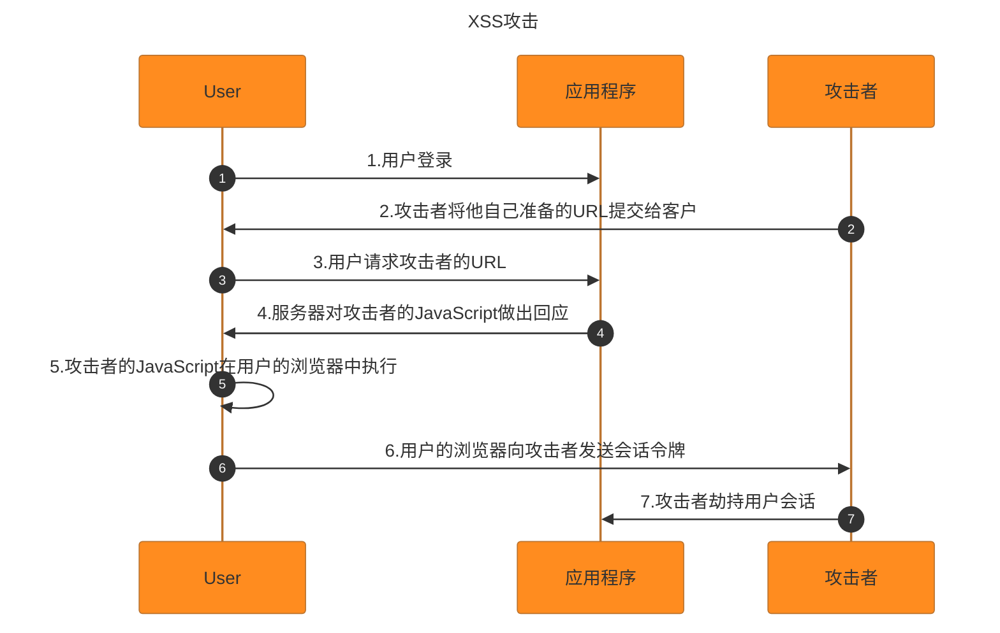
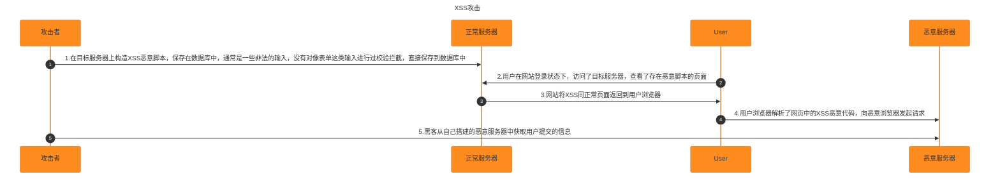

##### 什么是XSS攻击

> 跨站脚本攻击。是一种代码注入攻击手段，攻击者在正常的网页注入恶意的脚本代码，浏览器无法分辨哪些是恶意的脚本，当用户浏览器运行网页时，恶意脚本也会被浏览器执行。

###### XSS分类

| 类型        | 存储区(恶意代码存放的位置)  | 插入点 |
| ----------- | --------------------------- | ------ |
| 反射型      | URL                         | HTML   |
| 存储区      | 服务器数据库                | HTML   |
| DOM-Based型 | 服务器数据库/客户端存储/URL | 前端JS |

###### 反射型

> 又称为非持久性跨站点脚本攻击，这种攻击类型通过诱导用户点击恶意链接来造成一次行攻击，攻击者可以利用漏洞在网站上注入恶意代码，若受害者执行这段代码，攻击者就可以突破网站的访问限制冒充受害者。 

攻击步骤：

1. 攻击者把带有恶意脚本代码参数的URL地址发给用户
2. 用户点击此链接
3. 服务器端获取请求参数并且直接使用，服务器反射回结果页



###### 攻击示例

```
<script type="application/javascript">
        // 假设这是请求返回的数据
        const res = ['1', '2', '3', ''];
        const root = document.querySelector('#root');
        res.forEach((item) => {
          const p = document.createElement('p');
          p.innerHTML = item;
          root.append(p);
        });
  </script>
```

当数据返回，img会注入HTMLDOM中，又因为src是无效的URL，所以触发了onerror事件，从而执行了onerror定义的函数，这样获取了存储在客户端本地的localStorage。


###### 存储型

> 持久性跨站点脚本攻击，通常攻击者嫁给你代码存储到漏洞服务器中，用户浏览相关页面发起攻击

攻击步骤：

1. 攻击者将恶意脚本代码上传或存储到服务器

2. 服务器保存恶意脚本

3. 当正常客户访问服务器时，服务器会读取恶意恶意数据并直接使用
4. 服务器会返回含有恶意脚本的内容



###### 反射型XSS和存储型XSS的区别

> 反射型XSS漏洞常见于通过URL传递参数的功能，如网站搜索，跳转等
>
> 存储型XSS的恶意代码存在数据库里，反射型XSS的恶意代码在URL里

###### DOM Based型

> 不需要服务器支持，是基于DOM结构修改导致的

攻击步骤：

1. 用户打开带有恶意的链接
2. 浏览器在DOM解析的时候直接使用了恶意数据
3. 用户中招
4. 常见的触发场景：修改innerHTML,outerHTML,document.write的时候

常见恶意脚本

<strong style="color: red">`<input onfocus=write('xss') autofocus>`</strong>

<strong style="color: red">``</strong>

<strong style="color: red">``<svg onload=alert('xss') >``</strong>

<strong style="color: red">```<script>alert('xss')</script>```</strong>

<strong style="color: red">```<a href="javascript:alert('xss')">clickme</a>```</strong>
