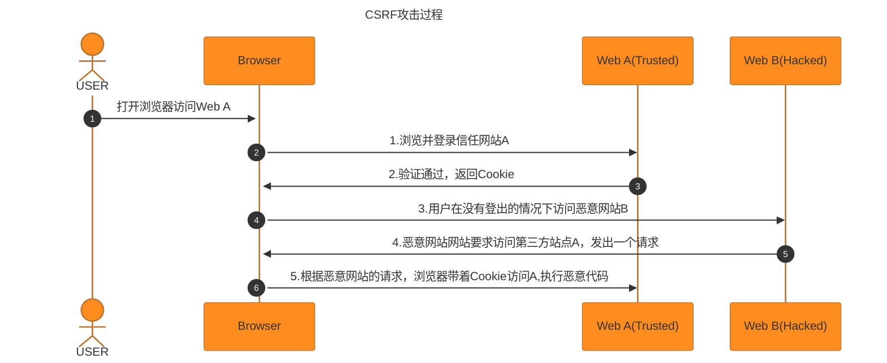
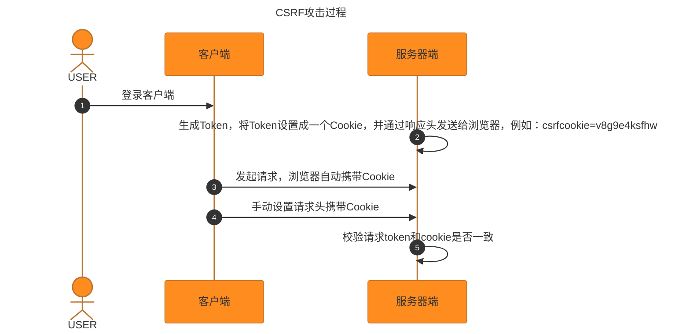

#### CSRF攻击

> CSRF跨站请求伪造，是一种网络攻击手段。攻击者诱导受害者进入第三方网站，在第三方网站中，向被攻击网站发送跨站请求。利用受害者在被攻击网站已经获取的注册凭证，绕过后台的用户验证，达到被冒充用户对被攻击的网站执行某项操作。

##### CSRF攻击方式

- 受害者登录a.com,并保留登录凭证Cookie
- 攻击者引诱受害者访问b.com
- b.com向a.com发送了一个请求：a.com/act=xx。浏览器会默认携带a.com的Cookie
- a.com接收到请求后，对请求进行验证，并确认是受害者的凭证，误以为是受害者自己发送的请求
- a.com以受害者的名义执行act=xxx
- 攻击完成，攻击者在受害者完全不知情的情况下，冒充受害者，让a.com执行了自己定义的操作

##### CSRF攻击特点

- 访问了第三方的恶意链接，通常是跨域的
- 在保持登录的状态访问，身份标志被冒用




##### 常见的攻击类型

-  <strong>GET类型的CSRF</strong>

  ```
  
  ```

  受害者在登录了银行网站，保存了Cookie的前提下。受害者访问含有这个img的页面，浏览器会发起http://back.example.com/transfer?account=xiaoming&amount=10000&for=hacker这个请求并携带登录银行网站保存的Cookie。这导致银行会认为这个请求是本人发起的，银行会根据请求参数执行操作。

- <strong>POST类型</strong>

  ```
  <form action="http://bank.example/transfer" method="POST">
    <input type="hidden" name="account" value="xiaoming" />
    <input type="hidden" name="amount" value="10000" />
    <input type="hidden" name="for" value="hacker" />
  </form>
  <script>
    document.forms[0].submit();
  </script>
  ```

​	访问带有这一段代码的恶意网站，表单会自动提交，相当于模拟用户完成了一次POST操作

- **链接类型**

  ```
  <a href="http://test.com/csrf/transfer.php?amount=1000&for=hacker" taget="_blank">重磅消息！！</a>
  ```

  需要点击才会触发

##### 攻击特点

- 一般发起在第三方网站
- 利用受害者被攻击网站的登录凭证
- 整个过程攻击者并不能活去到受害者的登录凭证，仅仅是冒用
- 跨站请求可以用各种方式：图片URL，超链接，CORS，FORM表单。部分请求可以直接嵌入第三方轮胎，文章中。
- 由于服务器的同源策略，黑客也无法进行解析。因此黑客无法从返回的结果中得到任何东西，只能做到给服务器发送请求，以执行请求中所描述的命令，在服务器端直接改变数据的值，而非窃取服务器中的数据。所以，保护的对象是那些可以直接改变的数据，对于读取操作，无需进行保护。

##### 防御思路

> 根据特点分析，CSRF通常发生在 __第三方域名__.攻击者__获取不到Cookie__等信息，只能__冒用__

- **防止不明外域访问**

> __同源检测机制__：服务器通过请求头携带Origin和Referer字段确定请求来源域。Origin和Referer都是表示请求的来源，区别是Origin仅包含协议，主机，端口，而Referer包含其余的Path参数。浏览器在发起请求时，通常会包含这两种头。

```
Origin: http://foo.example
根据HTTP协议，在HTTP请求头中有一个字段叫Referer，记录了该HTTP请求的来源地址
Referer来源地址，Referer中的Origin部分可以得到请求的来源域名
```

但是这种检测方式比较简单，而且对请求头的依赖过高。比如Origin标头在以下几种情况不存在：

- 跨域的重定向请求
- 跨域的媒体文件(图片，音频等)
- 请求协议不是HTTP，HTTPS，WebSocket,Gopher或者文件URL
- 响应网络错误

**使用Referrer的方式**

新版Referer Policy规定了五种Referer策略

1. **No Referrer**: no-referrer
2. **No Referrer When Downgrade**: no-referrer-when-downgrade
3. Origin Only: origin
4. Origin When Cross-origin: origin-when-crossorigin
5. Unsafe URL: unsafe-url

Content-Security-Policy响应头，通过referrer指令和5种可选指令来指定referrer策略

```
Content-Security-Policy: referrer no-referrer | no-referrer-when-downgrade | origin | origin-when-cross-origin | unsafe-url;
```

meta元数据标签可以指定referrer策略

``` 
<!-- 在任何情况下，仅发送文件的源作为引用地址 -->
<meta name="referrer" content="origin" />
```

外链标签中的referrer属性，或者用a,area,img,iframe,script,link标签元素上的referrer policy属性为其设置独立的请求策略

```
<a href="http://example.com" referrerpolicy="origin"></a>
```

可以在a,area,link元素上将rel属性设置为noreferrer

```
<a href="http://example.com" referrer="no-referrer|origin|unsafe-url">xxx</a>
```


**Samesite Cookie**

> set-cookie是一个通过服务器端向用户客户端发送cookie得响应头，用户代理可再后续的请求中将其发送回服务器。服务器发送多少个cookie，就携带多少个set-cookie响应头。这个头有一个属性叫SameSite，它允许服务器设定一条cookie不随跨站请求一起发送

```
Set-Cookie: CookieName=CookieValue; SameSite=Lax;
```

可取值

1. Strict：完全禁止第三方Cookie，跨站点时，任何情况下都不会发送cookie。只有当网页的URL与请求目标一致，才会带上Cookie
2. Lax：大多数情况不发送第三方Cookie，但是导航到目标网站的GET请求除外
3. None

**CSRF Token**

> 攻击者无法直接窃取用户信息，仅仅是冒用Cookie中的信息，而CSRF攻击之所以能够成功，是因为服务器误把攻击者发送的请求当成了用户自己的请求。那么可以要求所有用户请求都携带一个CSRF攻击者无法获取的Token。服务器通过校验请求携带的Token，来把正常的请求和攻击的请求区分开，也可以防范CSRF的攻击。

**策略防护步骤**:

1. **生成Token,存储在Session中，与会话绑定**

   > 用户登录，服务器生存一个CSRF Token存储在服务器端Session中，通常是健值对的形式存储，健是Token名称，值是Token值。将Token与用户恢会话绑定，用户请求携带会话ID访问服务器，服务器可以根据ID取出对应的Token

2. **将CSRF Token传递给客户端**

   > 服务器将生成的CSRF Token发送给客户端嵌入到网页中
   >
   > - 通过隐藏表单字段传递，适用于传统的HTML表单提交，服务器在渲染HTML页面是，将Token插入到隐藏字段中，当用户提交表单时，浏览器会将该隐藏字段与其他表单数据一起提交到服务器。
   > - 通过Cookie传递，适合于SPA 或AJAX请求场景，服务器将生成的Token通过Cookie的形式传递给客户端。浏览器会自动将Cookie存储在客户端，并在后续请求中携带。

   ```javascript
   // 获取 Cookie 中的 CSRF Token
   function getCsrfTokenFromCookie() {
       let csrfToken = document.cookie.split('; ').find(row => row.startsWith('csrf_token='));
       return csrfToken ? csrfToken.split('=')[1] : null;
   }
   
   // 在 AJAX 请求中使用 CSRF Token
   fetch('/submit', {
       method: 'POST',
       headers: {
           'Content-Type': 'application/json',
           'X-CSRF-Token': getCsrfTokenFromCookie()  // 自定义请求头发送 Token
       },
       body: JSON.stringify({data: 'example'})
   });
   
   
   ```

3. **客户端与服务器之间Token传递**

   > 每次用户请求，Token会随着请求一起发送服务器，服务器接收到请求后，会从请求数据中提取出Token，并与服务器存储的Token进行比较。
   >
   > 在服务器端，会话通常会存储在内存，数据库或文件中，并且会话ID通常通过HTTP Cookie传递给客户端。每次请求时，浏览器会自动携带会话ID的Cookie，服务器根据ID来检索会话数据并验证请求中CSRF Token是否匹配。

4. **会话周期管理**

   > 当用户第一次访问，会生成一个新的会话ID
   >
   > 会话通常有一个效期，超过时间会失效，需要重新登录


- **分布式校验**

> 在大型网站中，使用Session存储CSRF Token会带来很大的压力。访问单台服务器session是同一个。但是在大型网络中，服务器通常不止一台，可能是几十台甚至几百台，甚至多个机房都可能在不同的省份，用户发起的HTTP请求通常要经过像Nginx之类的负载均衡之后，再路由到具体的服务器上。由于Session默认存储在单机服务器内存中，因此在分布式环境下同一个用户发送的多次HTTP请求可能会先后落到不同的服务器上，导致后面发起的HTTP请求无法拿到之前的HTTP请求存储在服务器中的Session数据。从而使得Session机制在分布式环境下失效，因此在分布式集群中，CSRF Token需要存储在Redis之类的公共存储空间。

由于使用Session存储，读取和验证会引起比较大的复杂度和性能问题，很多网站采用Encrypted Token Pattern方式。这种方法的Token是一个计算出来的结果，而非随机生成的字符串。这样在校验的时候无需读取存储的Token，只需要在计算一次即可。

这种Token的值通常是UserID,时间戳和随机数，通过加密的方式生成。这样既可以保证分布式服务的Token一致，又能保证Token不容易被破解。

在Token解密成功后，服务器可以访问解析值，Token中包含的UserId和时间戳会被拿来验证有效性。当UserId和当前UserID进行比较。


- **双重Cookie验证**

> 同时使用两个Cookie来验证请求合法性，其中一个Cookie由浏览器自动发送，另一个需要通过请求头或者请求参数手动发送。这种方案对比CSRF Token方案来说，好在不需要生成额外的Token，不依赖于服务器端的会话状态因此也不需要存储Token，同样能够起到防御CSRF攻击的效果
>
> 虽然浏览器只要在某个与名下设置了Cookie，就默认会将后续的请求中自动携带Cookie，但是在跨域的请求中或者设置了SameSite，则不会携带，所以此方法不适合严格的跨域策略

流程：

1. 服务器端生成Token

2. 服务器将Token设置成一个Cookie，并通过响应头发送给浏览器，例如：csrfcookie=v8g9e4ksfhw

3. 浏览器在向服务器发起请求时，会自动携带csrfcookie的Token,这是浏览器默认行为

4. 客户端需要读取这个Cookie,并在请求时将其添加到请求中去，通常是作为请求参数或者自定义请求头传递

   ```javascript
   // 从 Cookie 中读取 CSRF Token
   function getCsrfTokenFromCookie() {
       let csrfToken = document.cookie.split('; ').find(row => row.startsWith('csrfcookie='));
       return csrfToken ? csrfToken.split('=')[1] : null;
   }
   
   // 在 AJAX 请求中使用双重 Cookie 传递 CSRF Token
   fetch('/submit', {
       method: 'POST',
       headers: {
           'Content-Type': 'application/json',
           'X-CSRF-Token': getCsrfTokenFromCookie()  // 自定义请求头传递 CSRF Token
       },
       body: JSON.stringify({data: 'example'})
   });
   ```

5. 服务器接收到客户端请求时，会有两个地方包含Token，自动发送的和手动发送的，验证这两个Token的一致性




- **用户操作权限**
