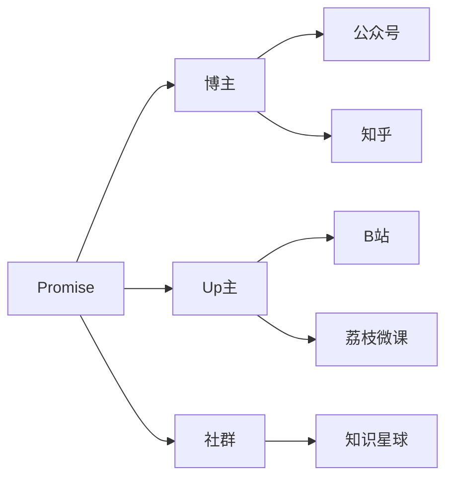

[typora画图语法](https://blog.csdn.net/qq_36075612/article/details/118161100)

[markdown](https://markdown.com.cn/basic-syntax/links.html)

Don't put tabs or spaces in front of your paragraphs.
Keep lines left-aligned like this.

